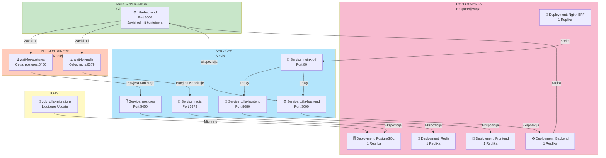
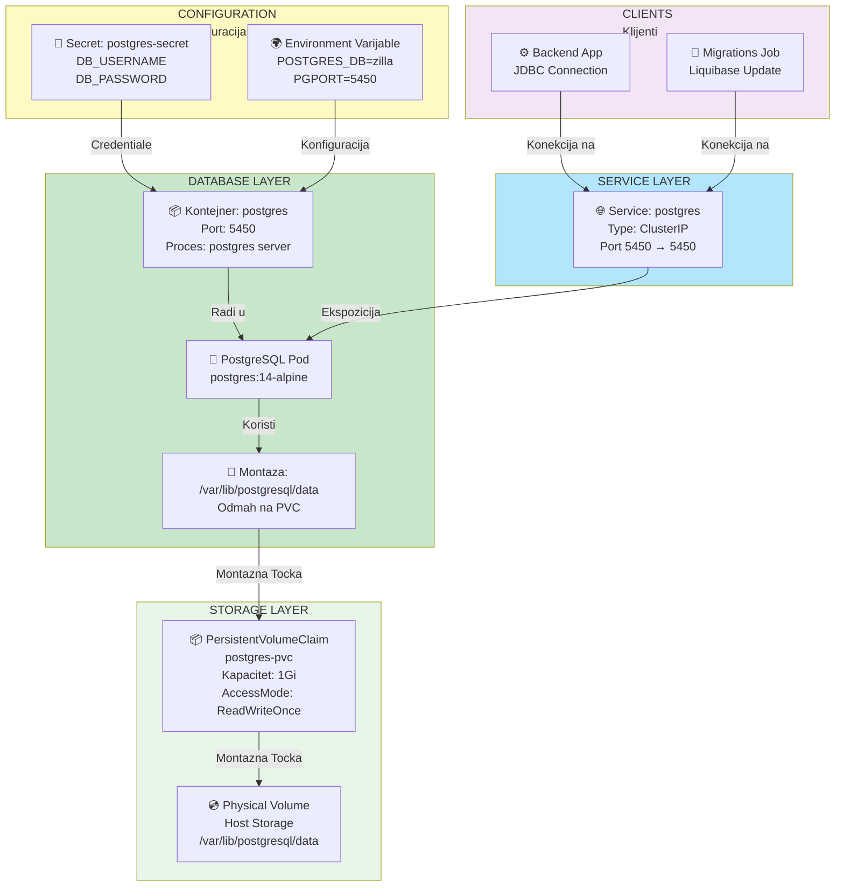
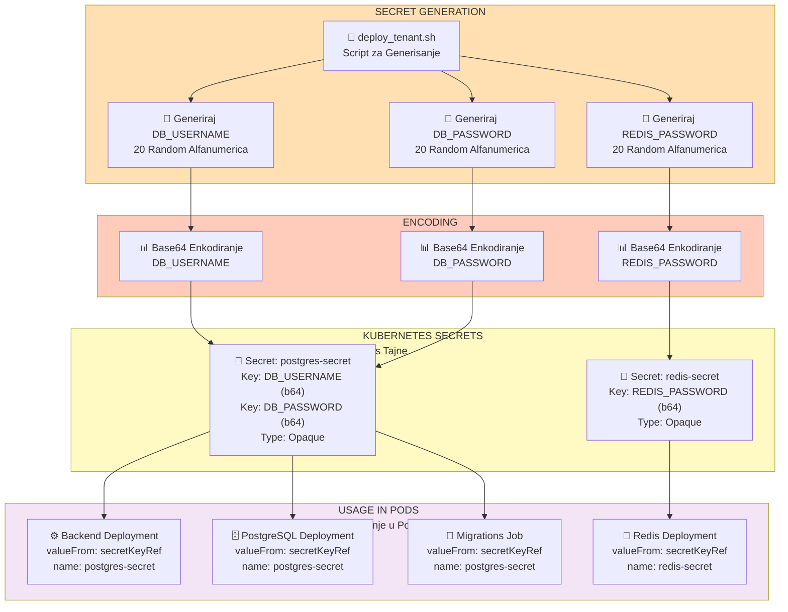
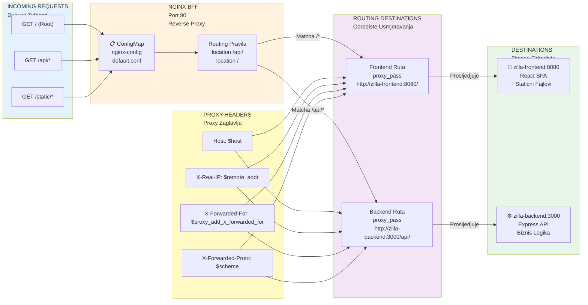
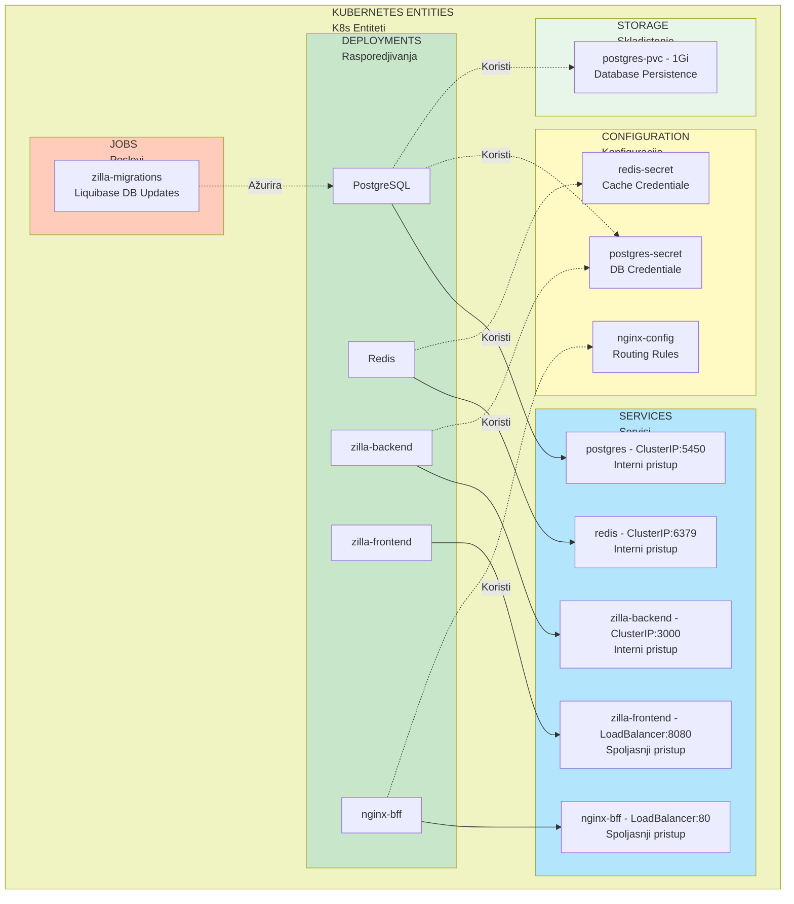

# Isolated Model - Kubernetes Architecture (Mermaid Diagrams)

## 1. 🏗️ Kompletan Sistem Dizajn (Complete System Design)

```mermaid
graph TB
    subgraph K8s ["Kubernetes Namespace"]
        subgraph ext["EXTERNAL ACCESS LAYER"]
            lb["⚙️ LoadBalancer Service<br/>nginx-bff:80<br/>Ekspozicija ka svetu"]
        end
        
        subgraph app["APPLICATION LAYER"]
            front["🖥️ Deployment: zilla-frontend<br/>Port: 8080<br/>React/Typescript"]
            back["⚡ Deployment: zilla-backend<br/>Port: 3000<br/>Express/Typescript API"]
            nginx_config["📋 ConfigMap: nginx-config<br/>Nginx Routing Konfiguracija"]
        end
        
        subgraph data["DATA & CACHE LAYER"]
            db["🗄️ Deployment: PostgreSQL<br/>Port: 5450<br/>Database: zilla<br/>Glavna Baza Podataka"]
            redis["💾 Deployment: Redis<br/>Port: 6379<br/>Distribuirani Kes"]
            pvc["📦 PersistentVolumeClaim<br/>postgres-pvc<br/>Storage: 1Gi"]
        end
        
        subgraph setup["MIGRATIONS & INIT"]
            job["🔄 Job: zilla-migrations<br/>Liquibase<br/>Izvrsavanje DB Migracija"]
            init1["⏳ Init Container<br/>wait-for-postgres<br/>Cekanje na DB"]
            init2["⏳ Init Container<br/>wait-for-redis<br/>Cekanje na Redis"]
        end
        
        subgraph sec["SECRETS MANAGEMENT"]
            sec_pg["🔐 Secret: postgres-secret<br/>DB_USERNAME, DB_PASSWORD"]
            sec_redis["🔐 Secret: redis-secret<br/>REDIS_PASSWORD"]
        end
    end
    
    User["👤 Korisnik/Pretraživač<br/>Client Side"]
    
    User -->|HTTP/HTTPS| lb
    lb -->|/api/*| back
    lb -->|/*| front
    front -->|REST Pozivi| back
    back -->|SQL Upiti| db
    back -->|Kesiranje| redis
    back --> init1
    back --> init2
    db --> pvc
    job -->|Migrira Schema| db
    back -.->|Koristi| sec_pg
    redis -.->|Koristi| sec_redis
    db -.->|Koristi| sec_pg
    nginx_config -->|Konfiguracija| lb
```mermaid

## 2. 📊 Data Flow - Tok Podataka (Kako Radi)

```mermaid
graph LR
    subgraph client["CLIENT SIDE"]
        browser["🌐 Web Pretraživač<br/>React SPA"]
    end
    
    subgraph lb_layer["LOAD BALANCER"]
        nginx["🔀 Nginx BFF<br/>Port 80<br/>Reverse Proxy"]
    end
    
    subgraph app_layer["APPLICATION"]
        fe["📱 Frontend<br/>Port 8080<br/>UI Serviranje"]
        be["⚙️ Backend<br/>Port 3000<br/>API Obrada"]
    end
    
    subgraph data_layer["DATA LAYER"]
        pg["🗄️ PostgreSQL<br/>Port 5450<br/>Relaciona BP"]
        redis["💾 Redis<br/>Port 6379<br/>Kes"]
    end
    
    browser -->|HTTP Zahtev na :80| nginx
    nginx -->|GET / <br/>Staticni Fajlovi| fe
    nginx -->|GET /api/* <br/>API Zahtevi| be
    
    fe -->|AXIOS na :80<br/>za /api/*| nginx
    
    be -->|SELECT/INSERT<br/>SQL Upiti| pg
    be -->|SET/GET<br/>Kesiranje| redis
    
    browser -.->|Prikazuje| fe
```

---

## 3. 🚀 Deployment Workflow - Proces Razvoja

```mermaid
graph TD
    start["🎯 Pocni Razvoj<br/>Izolovanog Okruzenja"] --> step1["📝 Pripremi Tenant Ime<br/>npr: amazon, google, etc"]
    
    step1 --> step2["🔨 deploy_tenant.sh<br/>my-tenant"]
    
    step2 --> step2_1["✓ Provjeri minikube prim<br/>Klaster"]
    step2_1 --> step2_2["✓ Kreiraj K8s Namespace<br/>kubectl create namespace"]
    step2_2 --> step2_3["🔐 Generiraj Tajne<br/>Random Credentiale<br/>DB_USERNAME: 20 chars<br/>DB_PASSWORD: 20 chars<br/>REDIS_PASSWORD: 20 chars"]
    step2_3 --> step2_4["📄 Kreiraj secrets.yaml<br/>Base64 Enkodiranje"]
    step2_4 --> step2_5["⚙️ Primjeni Kubernetes Manifest<br/>kubectl apply secrets<br/>kubectl apply dsp.yaml"]
    
    step2_5 --> step3["✅ Okruzenje Kreirano"]
    
    step3 --> check{"Trebas li<br/>Test Podatke?"}
    
    check -->|DA| step4["📊 seed_iso.sh<br/>namespace count"]
    step4 --> step4_1["👤 Kreiraj Admin Korisnika<br/>insert.admin.script.js"]
    step4_1 --> step4_2["👥 Kreiraj Batch Korisnika<br/>seed.users.script.js<br/>Default: 20 Korisnika"]
    step4_2 --> step4_3["💾 Snimi u CSV<br/>./passwords/tenant-users.csv"]
    step4_3 --> check2
    
    check -->|NE| ready["✅ Spreman za Upotrebu!"]
    check2{"Trebas li<br/>Testove?"}
    
    check2 -->|DA| step5["⚡ k6-test.sh<br/>tenant projects-count type"]
    step5 --> step5_1["🗑️ Purge Baza<br/>Obriši Postojeće Podatke"]
    step5_1 --> step5_2["📥 Seed Testni Podaci<br/>Pripremi Test Okruzenje"]
    step5_2 --> step5_3["🌉 Port Forwarding<br/>localhost:3000 →<br/>pod/backend:3000"]
    step5_3 --> step5_4["🧪 Pokretanje k6 Testa<br/>Load/Stress/Soak"]
    step5_4 --> step5_5["📈 Generisanje Izvjestaja<br/>Performanse i Rezultati"]
    step5_5 --> ready
    
    ready --> end["🎊 Spreman za Upotrebu!"]
    
    style start fill:#c8e6c9
    style end fill:#c8e6c9
    style ready fill:#ffecb3
    style check fill:#b3e5fc
    style check2 fill:#b3e5fc
```

---

## 4. 🔄 Service Dependencies - Zavisnosti Servisa



---

## 5. 🗄️ Database Architecture - Arhitektura Baze Podataka



---

## 6. 🔐 Security & Secrets - Sigurnost i Tajne



---

## 7. 🧪 Testing Workflow - Testiranje Radnog Toka

```mermaid
graph TD
    start["🎯 k6-test.sh<br/>tenant projects-count type"] --> purge["🗑️ PURGE FASE<br/>Brisanje Podataka"]
    
    purge --> purge1["./purge_iso.sh tenant<br/>Obriši sve iz Baze"]
    purge1 --> purge2["Reset Database Status<br/>Spremi za nove podatke"]
    
    purge2 --> seed["📥 SEED FASE<br/>Punjenje Test Podaka"]
    
    seed --> seed1["./seed_iso.sh tenant USERS_COUNT<br/>USERS_COUNT = projects × 10"]
    seed1 --> seed2["Kreiraj Admin Korisnika<br/>admin@tenant.dne.com"]
    seed2 --> seed3["Kreiraj Batch Korisnika<br/>Default: 20 Korisnika"]
    seed3 --> seed4["Spremi Credentiale u CSV"]
    
    seed4 --> forward["🌉 PORT FORWARDING"]
    
    forward --> forward1["Provjera Port 3000<br/>Kill ako je zauzet"]
    forward1 --> forward2["kubectl port-forward<br/>localhost:3000 → pod:3000"]
    forward2 --> forward3["Cekanje na Readiness<br/>Health Check: /api/health"]
    
    forward3 --> test["🧪 K6 TESTING FASE"]
    
    test --> test_type{"Tip Testa?"}
    
    test_type -->|LOAD| load["📈 Load Test<br/>Simulacija Normal Opterecenja<br/>k6-load-test.js"]
    test_type -->|STRESS| stress["⚠️ Stress Test<br/>Simulacija Peak Opterecenja<br/>Raste sa Vremenom<br/>k6-stress-test.js"]
    test_type -->|SOAK| soak["🔄 Soak Test<br/>Dugotrajno Testiranje<br/>Trazenje Memory Leak-a<br/>k6-soak-test.js"]
    
    load --> metrics["📊 Prikupi Metrike<br/>Response Time<br/>Throughput<br/>Error Rate"]
    stress --> metrics
    soak --> metrics
    
    metrics --> results["📈 RESULTATI"]
    
    results --> results1["Generiši Izvjestaj<br/>JSON Format"]
    results1 --> results2["Snimi Log Fajlove<br/>./output/"]
    results2 --> results3["Analiziraj Performanse<br/>Bottleneck Identifikacija"]
    
    results3 --> cleanup["🧹 CLEANUP FASE"]
    
    cleanup --> cleanup1["Kill Port Forwarding<br/>Oslobodi Port 3000"]
    cleanup1 --> end["✅ Test Kompletan"]
    
    style start fill:#c8e6c9
    style purge fill:#ffccbc
    style seed fill:#ffe0b2
    style forward fill:#b3e5fc
    style test fill:#f8bbd0
    style test_type fill:#fff9c4
    style load fill:#ffebee
    style stress fill:#fbe9e7
    style soak fill:#ede7f6
    style results fill:#e0f2f1
    style cleanup fill:#f3e5f5
    style end fill:#c8e6c9
```

---

## 8. 📋 ConfigMap: Nginx Routing - Nginx Usmjeravanje



---

## 9. 🎯 Quick Reference: Entiteti i Uloge



---

## 📚 Legenda i Objasnjenja (Legend and Explanations)

| Simbol | Znacenje | Objasnjenje |
|--------|----------|-----------|
| 🗄️ | PostgreSQL | Relacijska baza podataka za skladistenje struktuiranih podataka |
| 💾 | Redis | In-memory cache za brz pristup i sesijsko skladistenje |
| ⚙️ | Backend | Node.js/Express API servic sa poslovnom logikom |
| 📱 | Frontend | React SPA aplikacija za korisnički interfejs |
| 🔀 | Nginx BFF | Reverse proxy i backend-for-frontend za routing |
| 🌐 | LoadBalancer | Servis za spoljasnji pristup iz interneta |
| 🔐 | Secret | Zastitena K8s konfiguracija sa credentialima |
| 📋 | ConfigMap | Javna K8s konfiguracija bez tajnih podataka |
| 📦 | PVC | Persistent Volume Claim za trajno skladistenje |
| 🔄 | Job | Jednom izvršavan posao - migracije |
| ⏳ | Init Container | Inicijalni kontejner - provjera zavisnosti |

---

## 🚀 Brz Pokretanje (Quick Start)

```bash
# 1. Kreiraj novi tenant namespace
./isolated/deploy_tenant.sh my-tenant

# 2. Punjenje test podacima (20 korisnika default)
./isolated/seed_iso.sh my-tenant 50

# 3. Pokretanje load testa
./isolated/k6-test.sh my-tenant 20 load

# 4. Provjera stanja deployment-a
kubectl get all -n my-tenant

# 5. Brisanje okruzenja
kubectl delete namespace my-tenant
```

---

**Kreirano za**: Zilla Minikube Isolated Model  
**Arhitektura**: Multitenant K8s sa po-tenant izolacijom  
**Teststiranje**: k6 load testing za performanse  
**Jezik**: Srpski (latinica) sa engleskim terministima
