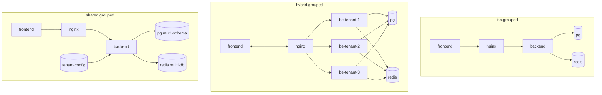
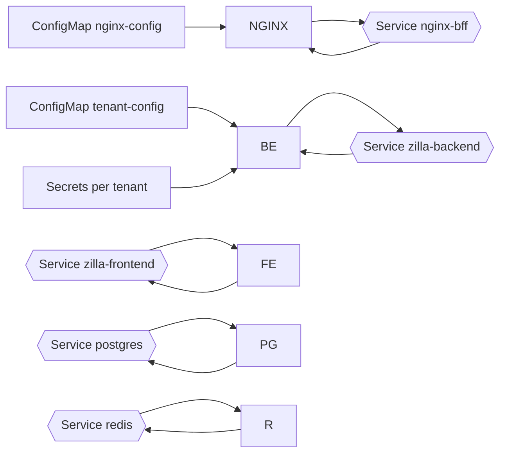

## GROUPED model (iso + hybrid + shared)

- Three namespaces in one cluster:
  - `iso.grouped`: one/more isolated tenants (like ISO model)
  - `hybrid.grouped`: shared FE, N BEs (like HYBRID)
  - `shared.grouped`: fully shared (like SHARED)
- Each subgroup keeps its own secrets and (where applicable) migrations.

High-level topology

Kubernetes entity wiring (shared.grouped example)

Key commands
- Apply grouped ISO: `kubectl apply -f models/grouped/iso.grouped/manifest-iso.yaml`
- Apply grouped HYBRID: `kubectl apply -f models/grouped/hybrid.grouped/k8s.yaml && kubectl apply -f models/grouped/hybrid.grouped/migrations.yaml`
- Apply grouped SHARED: `kubectl apply -f models/grouped/shared.grouped/k8s.yaml && kubectl apply -f models/grouped/shared.grouped/migrations.yaml`
- Port-forward Nginx: `minikube -p grouped kubectl -- port-forward -n <ns> svc/nginx-bff 8080:80`
