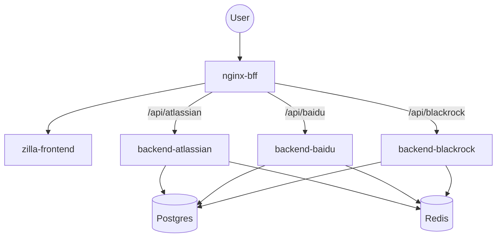
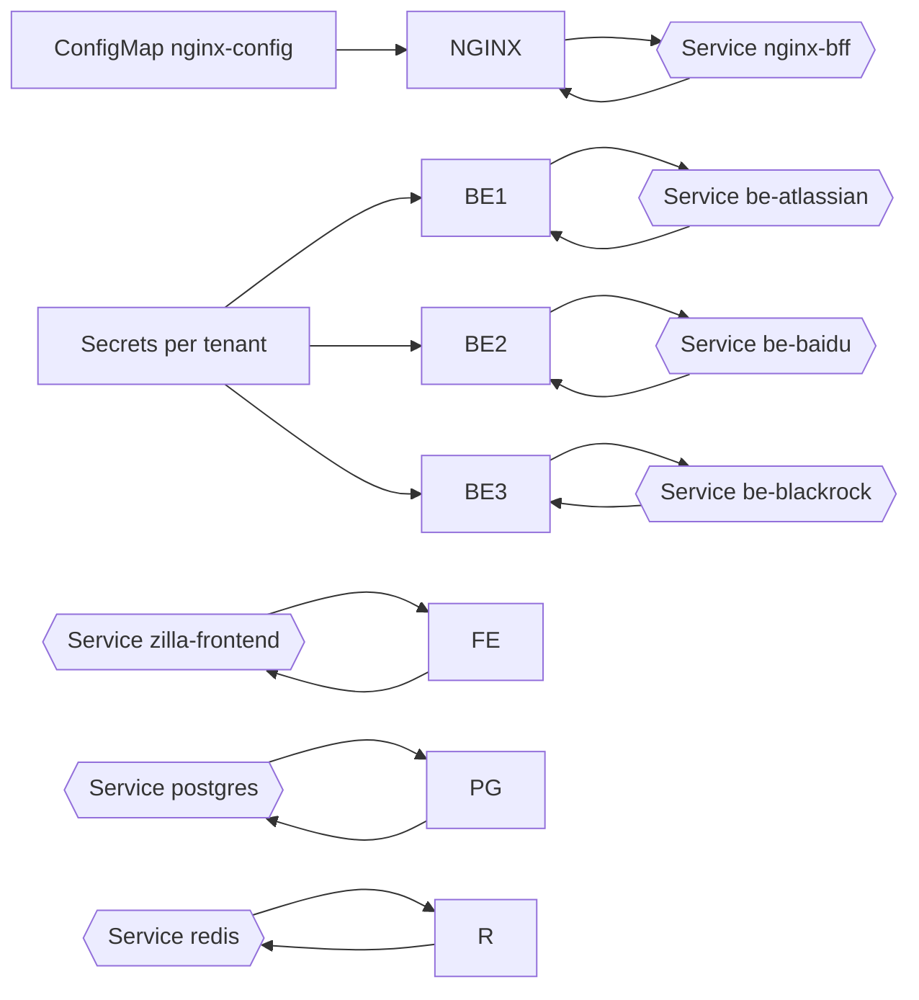

## HYBRID model (shared FE, per-tenant BEs)

- One namespace. Single Frontend, N Backends (one per tenant), one Postgres, one Redis, and one Nginx BFF routing by path.
- Per-tenant secrets under `models/hybrid/tenants/<tenant>/secrets.yaml`.
- Manifests in `models/hybrid/k8s.yaml` and `models/hybrid/migrations.yaml`.

Routing and component flow

Kubernetes entity wiring

Key commands
- Apply Hybrid: `kubectl apply -f models/hybrid/k8s.yaml && kubectl apply -f models/hybrid/migrations.yaml`
- Port-forward Nginx: `minikube -p hybrid kubectl -- port-forward -n hybrid svc/nginx-bff 8080:80`
