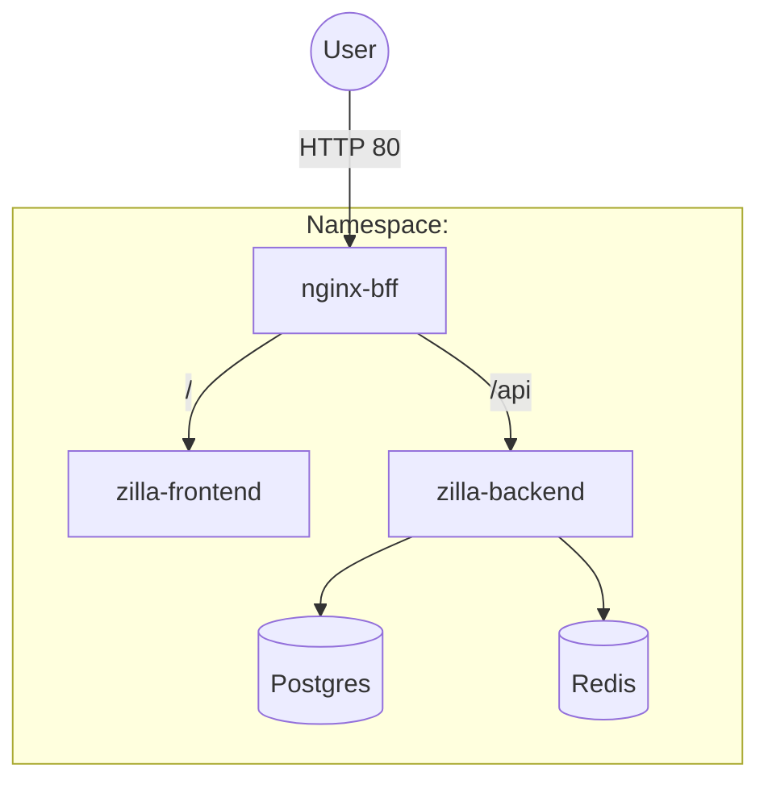
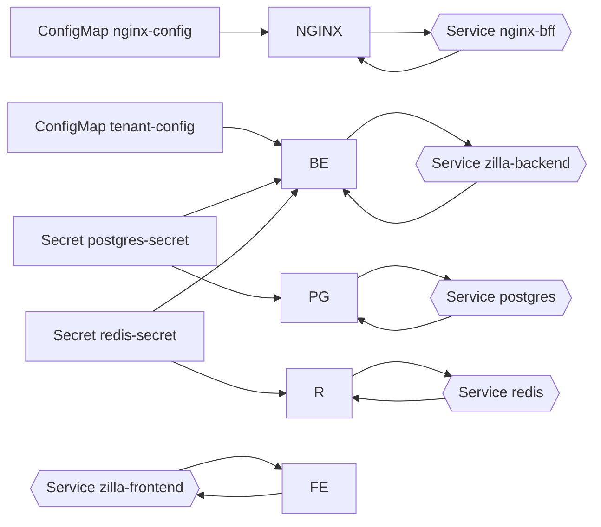

## ISO model (per-tenant isolation)

- One namespace per tenant. Each has its own Frontend, Nginx BFF, Backend, Postgres, Redis.
- Single tenant-agnostic manifest applied with `-n <tenant>`.
- Per-tenant secrets include DB_USERNAME/DB_PASSWORD (admin) and DB_USER_TENANT/DB_PASS_TENANT (app). `tenant-config` ConfigMap carries a single-tenant entry.

Component flow (per tenant)

Kubernetes entity wiring

Key commands
- Apply ISO tenants: `models/iso/start-iso.sh`
- Port-forward Nginx: `minikube -p iso kubectl -- port-forward -n <tenant> svc/nginx-bff 8080:80`
