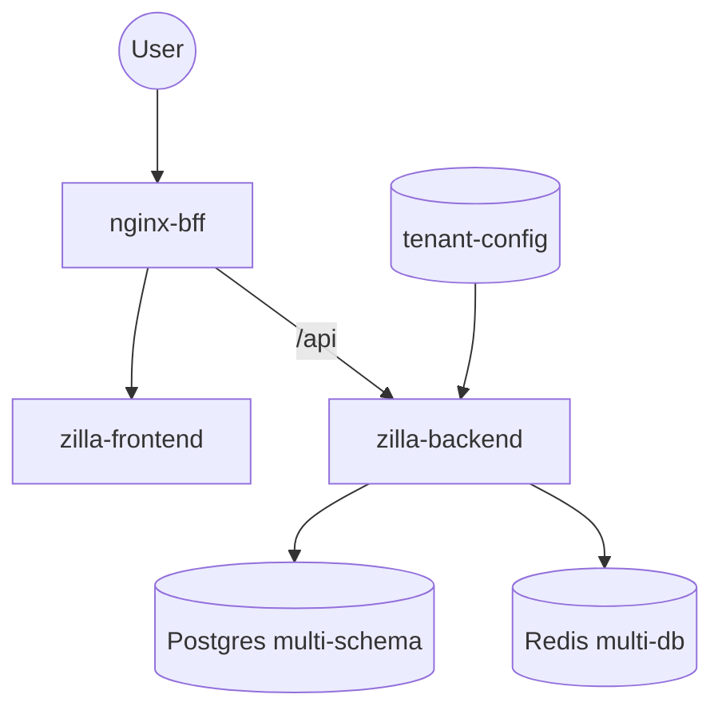
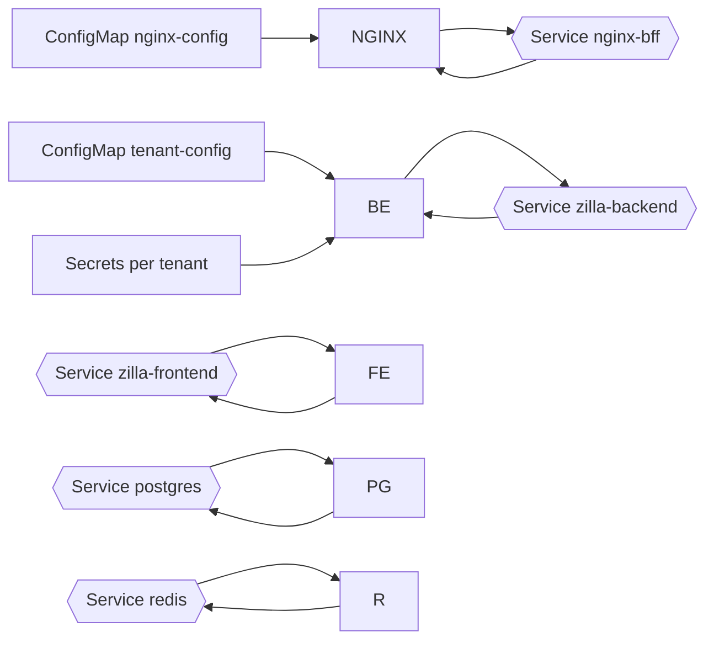

## SHARED model (fully shared FE/BE)

- One namespace. Single Frontend and Backend shared by all tenants; one Postgres (multi-schema), one Redis (multiple DBs).
- Per-tenant secrets under `models/shared/tenants/<tenant>/secrets.yaml` supply DB creds; Backend reads them via env and a tenant-config ConfigMap.
- Manifests in `models/shared/k8s.yaml` and `models/shared/migrations.yaml`.

Component flow

Kubernetes entity wiring

Key commands
- Apply Shared: `kubectl apply -f models/shared/k8s.yaml && kubectl apply -f models/shared/migrations.yaml`
- Port-forward Nginx: `minikube -p shared kubectl -- port-forward -n shared svc/nginx-bff 8080:80`
