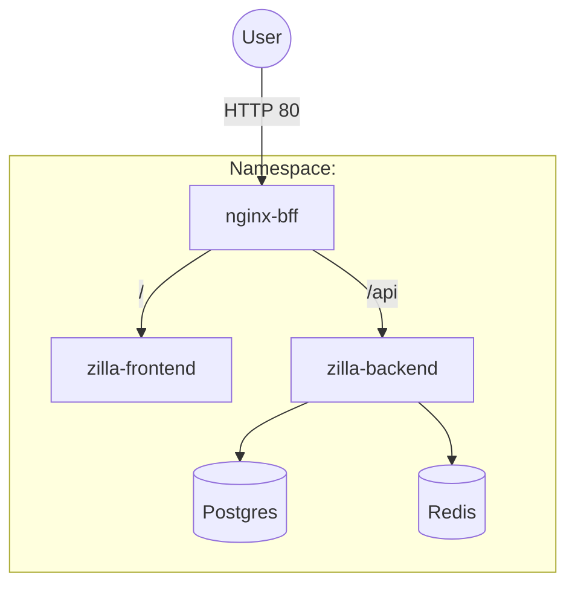
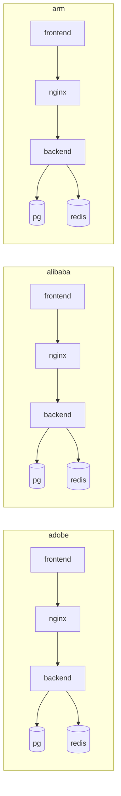
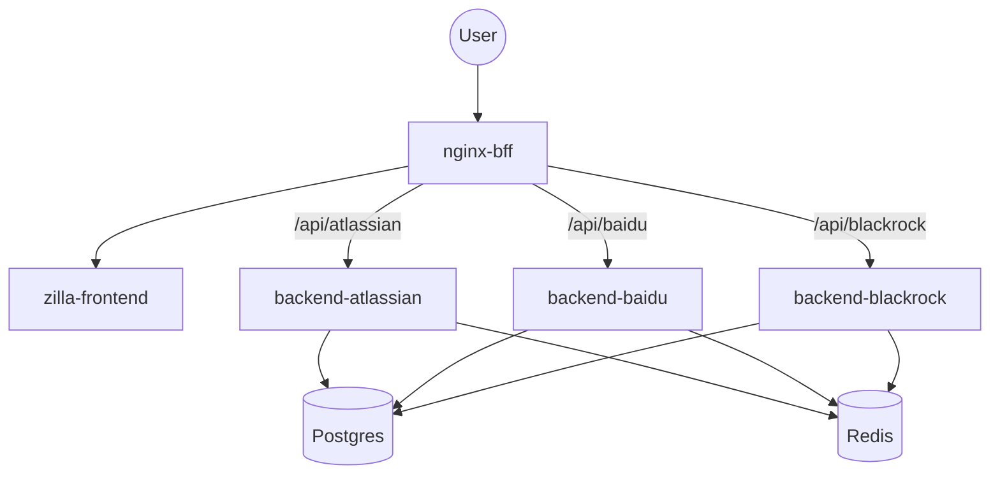
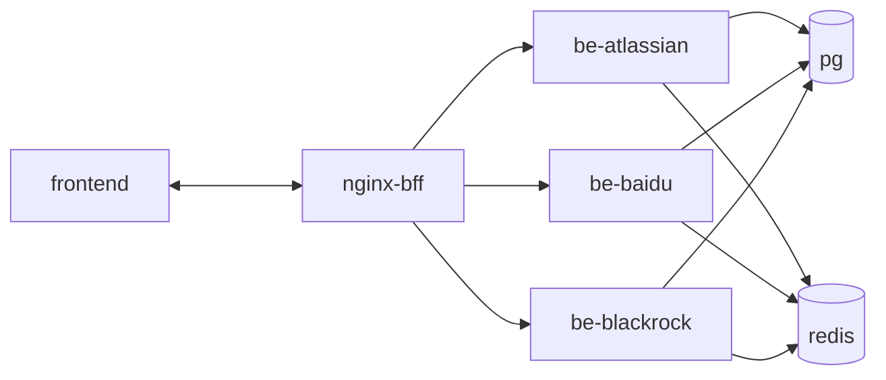
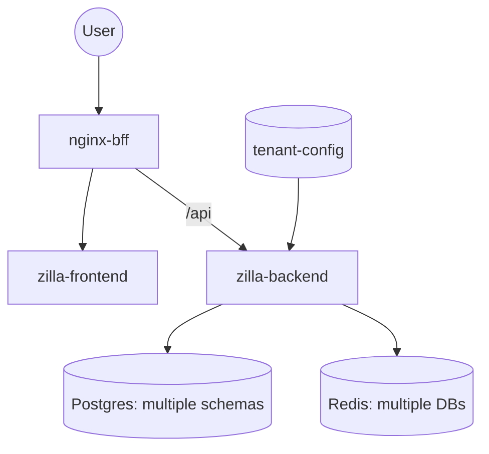
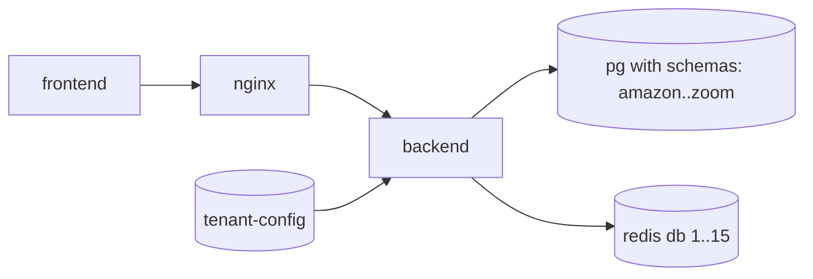
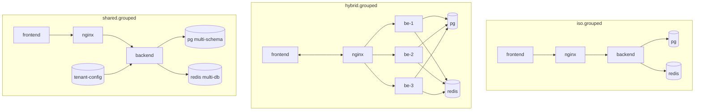
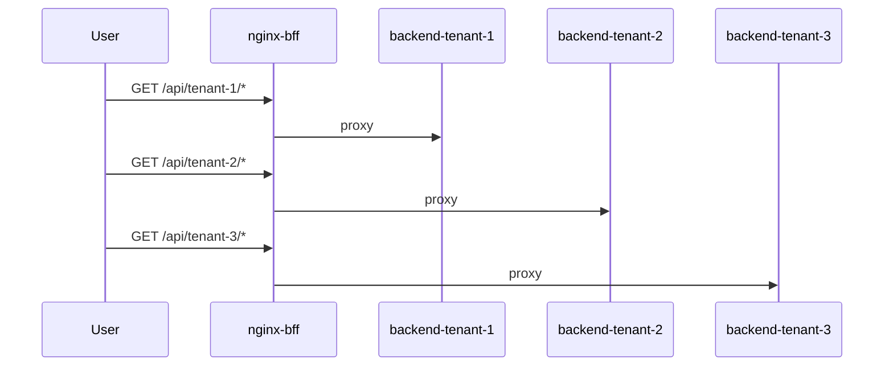

## Zilla multi-tenant models

This document outlines the 4 deployment models and their topology. Each model includes two Mermaid diagrams: a component flow and a cluster/topology view.

Resource targets (per pod unless noted):
- Frontend, Backend: iso/hybrid/grouped.shared: 128Mi, 0.25 CPU; shared: 256Mi, 0.5 CPU
- Postgres (per instance): 1Gi RAM, 0.5 CPU, 3Gi PVC
- Redis, Nginx: 64Mi, 0.1 CPU

---

### ISO model (isolated per-tenant)
- One namespace per tenant. Each tenant has its own Frontend, Nginx BFF, Backend, Postgres, and Redis.
- Single manifest is tenant-agnostic; apply with `-n <tenant>`.
- Per-tenant secrets contain admin keys and DB_USER_TENANT/DB_PASS_TENANT; per-tenant backend configmap `tenant-config` holds the single-tenant entry.

Component flow per tenant

3-tenant topology (example)

---

### HYBRID model (shared FE, N backends)
- One namespace. Single Frontend + N Backends (one per tenant), one Postgres, one Redis, and an Nginx BFF that routes by path.
- Per-tenant secrets live under `tenants/<tenant>/secrets.yaml`.

Component flow

Topology

---

### SHARED model (fully shared)
- One namespace. Single Frontend, single Backend, one Postgres, one Redis, and tenant-config ConfigMap with all tenants.
- Per-tenant secrets under `tenants/<tenant>/secrets.yaml` provide per-tenant DB creds for the shared Backend.

Component flow

Topology

---

### GROUPED model (mixed: isolated + hybrid + shared)
- Three namespaces:
  - iso.grouped: one or more fully isolated tenants
  - hybrid.grouped: shared FE, N backends
  - shared.grouped: fully shared
- Each subgroup follows the rules of its respective model.

High-level topology

Hybrid.grouped routing focus

---

### Capacity quick reference (requests)
- ISO (per tenant): ~1.5 Gi, hybrid (whole ns with 3 tenants): ~1.6–2.0 Gi, shared: ~1.6 Gi
- For 3 ISO tenants: ~4.5 Gi
- Add 20–30% headroom for kube-system and bursts.

### Common commands
- Start clusters (all or single):
  - `./start_clusters.sh`
  - `./start_clusters.sh iso`
- Deploy ISO tenants: `models/iso/start-iso.sh`
- Diagnose ISO: `scripts/diagnose_iso.sh --fix`
