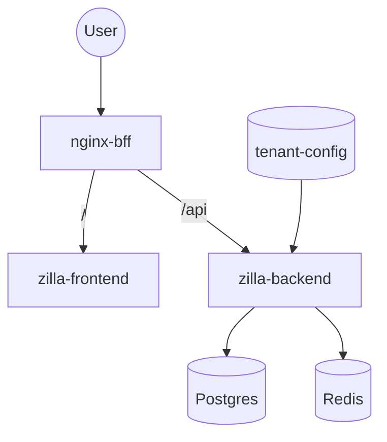
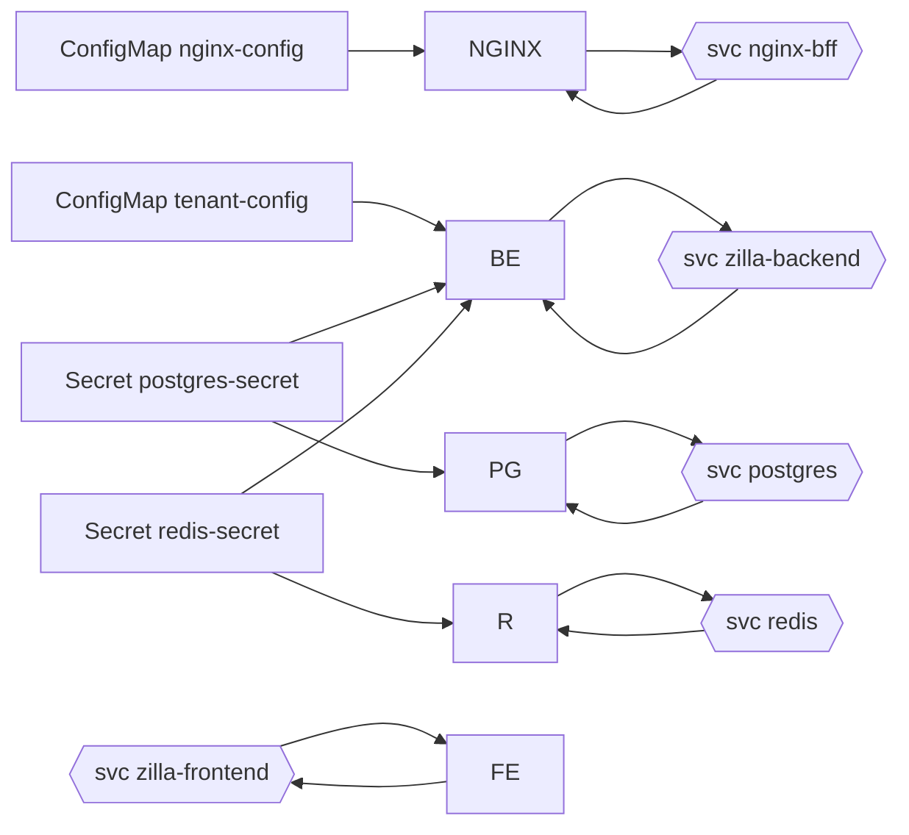
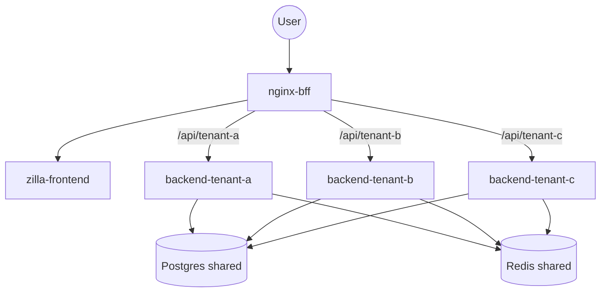
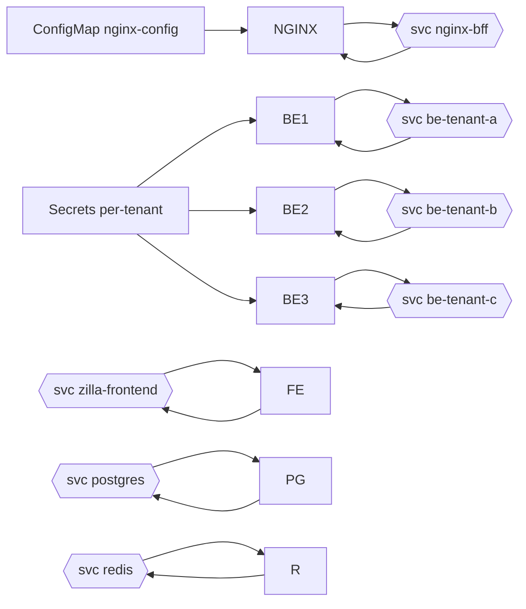
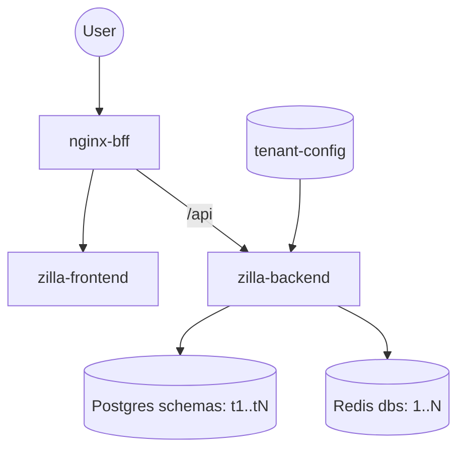
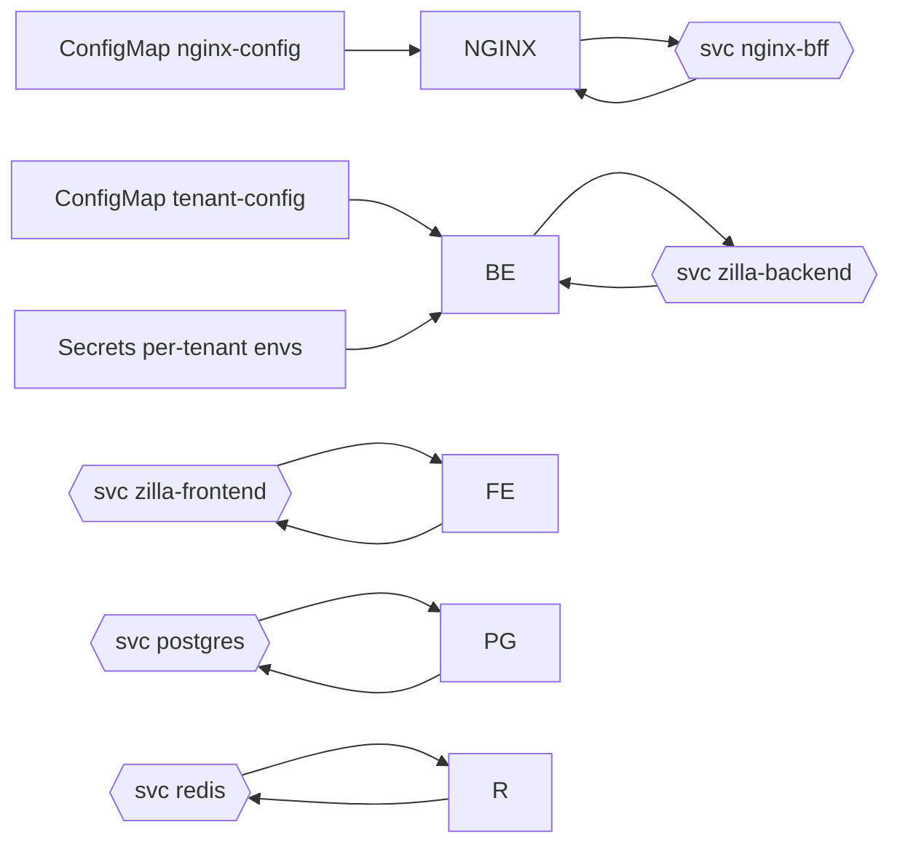
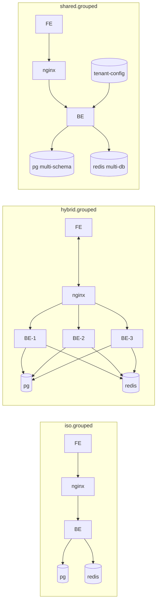

## Zilla models overview

This document summarizes all deployment models: how they are configured, what components they contain, and how they handle data and tenant isolation.

Global components (common across models)
- Frontend: `zilla-frontend`
- Nginx BFF: `nginx-bff` with `nginx-config` ConfigMap
- Backend: `zilla-backend`
- Postgres: one or more instances; DB name `zilla`
- Redis: cache/session store
- Secrets: Postgres and Redis
- Tenant config: `tenant-config` ConfigMap (JSON), where applicable

Key configuration locations
- ISO: `models/iso/manifest-iso.yaml` (tenant-agnostic), `models/iso/tenants/<tenant>/*.yaml`
- HYBRID: `models/hybrid/k8s.yaml`, `models/hybrid/migrations.yaml`, `models/hybrid/tenants/<tenant>/secrets.yaml`
- SHARED: `models/shared/k8s.yaml`, `models/shared/migrations.yaml`, `models/shared/tenants/<tenant>/secrets.yaml`, `models/shared/platform-secrets.yaml`
- GROUPED: `models/grouped/{iso.grouped|hybrid.grouped|shared.grouped}/...`
- Cluster bootstrap: `start_clusters.sh`

---

### ISO (isolated per tenant)
- Per-tenant namespace. Apply the same manifest with `-n <tenant>`.
- Components (per tenant): Frontend, Nginx, Backend, Postgres, Redis.
- Secrets per tenant: `postgres-secret` contains admin DB_USERNAME/DB_PASSWORD and app creds DB_USER_TENANT/DB_PASS_TENANT. `redis-secret` contains REDIS_PASSWORD.
- Tenant config per tenant: `tenant-config` (single-tenant JSON) mounted to Backend; Backend uses TENANT_CONFIG_PATH.
- Isolation
  - Compute/network: namespace and per-tenant Deployments/Services
  - Data: per-tenant Postgres instance and Redis instance
  - Secrets: per-tenant

ISO flow

ISO k8s wiring

---

### HYBRID (shared FE, per-tenant BEs)
- One namespace. Single Frontend and Nginx; one Postgres and Redis; one Backend per tenant.
- Secrets: per-tenant secrets under `tenants/<tenant>` supply DB user/password for that tenant’s backend.
- Nginx routes by path (e.g., `/api/<tenant>/...`) to the respective backend Service.
- Isolation
  - Compute: per-tenant backend Deployments
  - Data: single Postgres and Redis shared at instance level; backends use tenant-specific DB users/schemas
  - Secrets: per-tenant

HYBRID flow

HYBRID k8s wiring

---

### SHARED (fully shared FE/BE)
- One namespace. Single Frontend and Backend; one Postgres (multi-schema) and Redis (multiple DB indexes).
- Secrets: per-tenant secrets provide DB user/password (e.g., DB_USER_AMAZON) read by Backend as envs.
- Tenant config: `tenant-config` (all tenants JSON) mounted to Backend.
- Isolation
  - Compute: shared Deployments
  - Data: schema-level (Postgres) and DB-index-level (Redis)
  - Secrets: per-tenant

SHARED flow

SHARED k8s wiring

---

### GROUPED (mixed)
- Three namespaces, one per subgroup:
  - `iso.grouped`: isolated tenants (like ISO)
  - `hybrid.grouped`: shared FE + per-tenant BEs (like HYBRID)
  - `shared.grouped`: fully shared (like SHARED)
- Isolation follows the underlying subgroup’s rules.

GROUPED topology

---

### Operational notes
- Resource requests/limits
  - ISO (per tenant default): FE 256Mi/512Mi, BE 128Mi/128Mi, PG 1Gi/1Gi (+3Gi PVC), Redis 64Mi/64Mi, Nginx 64Mi/64Mi
  - HYBRID: FE/BE 128Mi, PG 1Gi, Redis 64Mi
  - SHARED: FE/BE 256Mi/0.5 CPU
- Start clusters: `./start_clusters.sh [iso|hybrid|grouped|shared]`
- Deploy ISO tenants: `models/iso/start-iso.sh`
- Port-forward Nginx per ns: `minikube -p <profile> kubectl -- -n <ns> port-forward svc/nginx-bff 8080:80`
